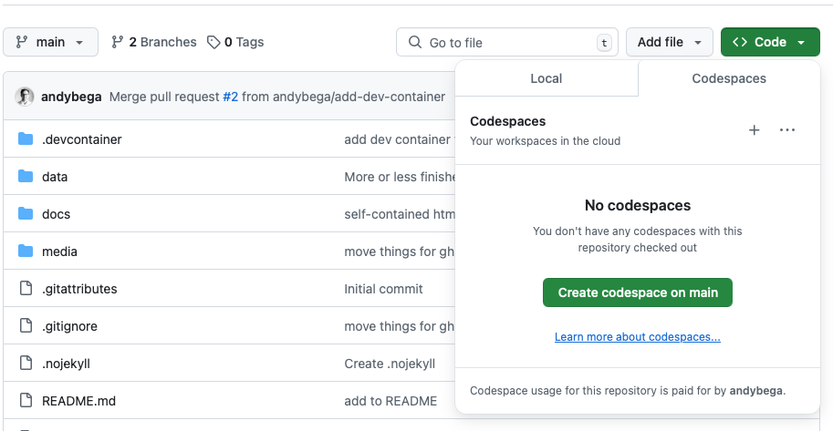
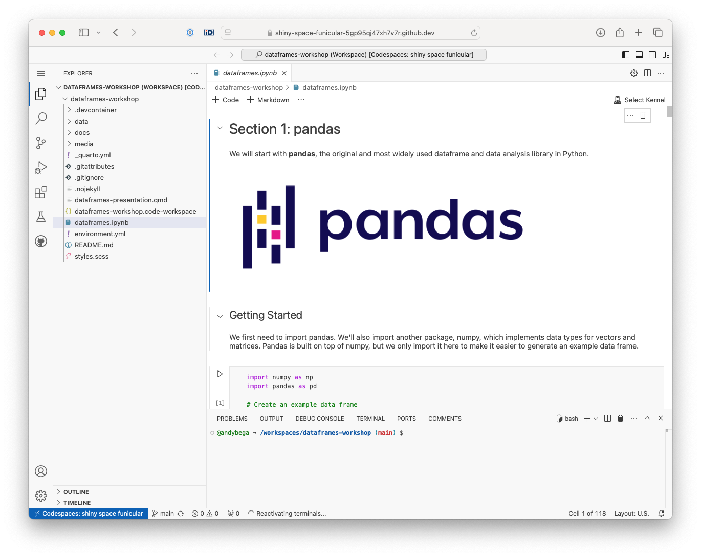

# DataFrames Workshop

Nov 27, 2024 | [PyData Meetup #3](https://www.meetup.com/pydata-tallinn/events/303780916) | Python CodeClub Meetup

This is a introductory workshop covering dataframes in Python with the [**pandas**](https://pandas.pydata.org) and [**polars**](https://pola.rs) libraries. 

The main content is in the [dataframes.ipynb](dataframes.ipynb) Jupyter notebook. 

- [Rendered notebook (dataframes.ipynb)](https://www.andybeger.com/dataframes-workshop/dataframes)
- [Slides](https://www.andybeger.com/dataframes-workshop/dataframes-presentation.html)
- [Dataframe library benchmarks (h2oai)](https://h2oai.github.io/db-benchmark/)


## Setup

If you haven't worked with git/GitHub or Jupyter notebooks before, the easiest way is to use GitHub Codespaces to open [dataframes.ipynb](dataframes.ipynb).

### GitHub codespaces

1. Click on the Code button on the top right and select _Code_ > _Create codespaces on main_. It will start building a container. This might take a while. 



2. After the codespace is setup, you should get a VS Code view like this:



Open [dataframes.ipynb](dataframes.ipynb) and you are ready to go. 

### Clone and run locally

1. Clone the repo
```
git clone https://github.com/andybega/dataframes-workshop.git
```

2. Setup dev environment
- a. Use the dev container via your IDE, or
- b. Create a Conda env with dependencies
```
conda env create --file=environment.yml
```

### Just follow along

If you just want to follow along without having an interactive notebook to experiment with, you can either just open the [dataframes.ipynb](dataframes.ipynb) preview here in GitHub, or, look at a nicer [rendered HTML version](https://www.andybeger.com/dataframes-workshop/dataframes.html) of it. 